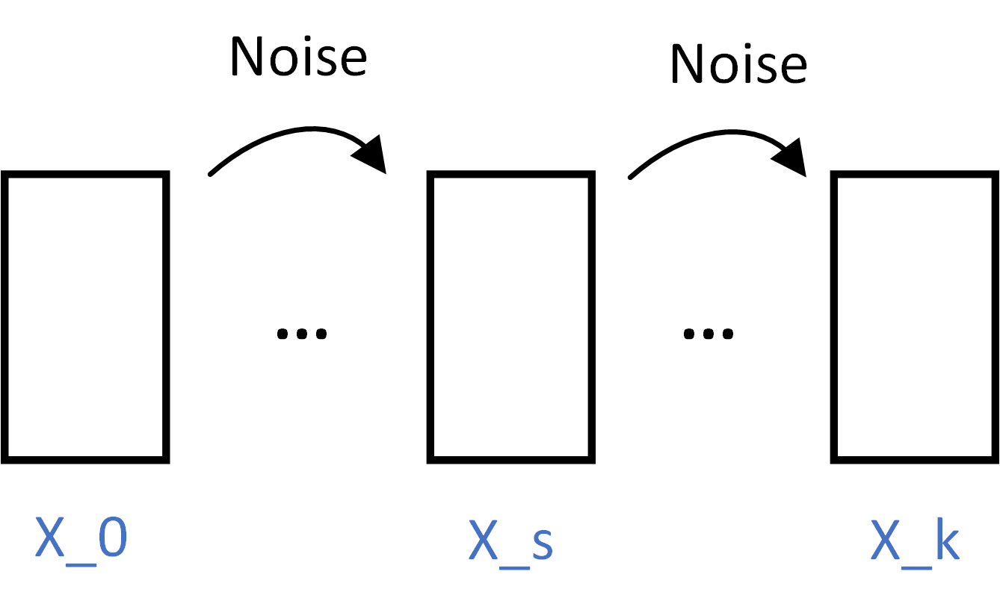
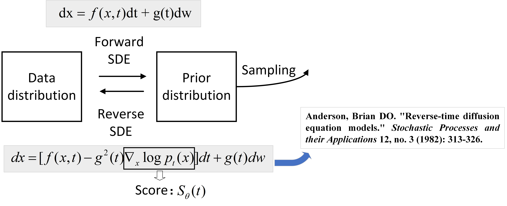

## 1. DDIM

:rocket: DDIM 可以看作是DDPM的一个重要改进。DDIM 和 DDPM在前向加噪中是等价的，但 DDIM 则是在此基础上提出的一种**更高效的采样方法**。

如0，s，k时刻样本的加噪如下所示，k-s>1：



有 $x_k=\sqrt{\bar{\alpha}_k} \cdot x_0 + \sqrt{1-\bar{\alpha}_k}\cdot \epsilon=\mathcal{N}(\sqrt{\bar{\alpha}_k} \cdot x_0, (1-\bar{\alpha}_k)\mathbf{I})$ ，后验分布：

```math
​								 q(x_s|x_k,x_0)=\frac{q(x_k|x_s,x_0)q(x_s|s_0)}{q(x_k|x_0)}=\mathcal{N}(mx_k+kx_0,\sigma^2 \mathbf{I})    							(1)
```
所以 $x_s$ 为

```math
 \begin{split}x_s &= mx_k + kx_0 + \sigma \epsilon \\ &= m (\sqrt{\bar{\alpha}_k} \cdot x_0 + \sqrt{1-\bar{\alpha}_k}\cdot \epsilon_1) + kx_0 + \sigma \epsilon\\&= x_0 (m \sqrt{\bar{\alpha}_k} + k) + m \sqrt{1-\bar{\alpha}_k} \epsilon_1 + \sigma \epsilon\\&= \mathcal{N}(x_0 (m \sqrt{\bar{\alpha}_k} + k), m^2 (1-\bar{\alpha}_k) + \sigma^2)\end{split}   (2)
```

联立前向加噪和（2），可得：

```math
​	\begin{cases}m \sqrt{\bar{\alpha}_k} + k = \sqrt{\bar{\alpha}_s} \\m^2 (1-\bar{\alpha}_k) + \sigma^2 = 1-\bar{\alpha}_s\end{cases}					(3)
```

解得：

```math
​	\begin{cases}m=\sqrt{\frac{1-\bar{\alpha}_s-\sigma^2}{1-\bar{\alpha}_k}}\\k=\frac{\sqrt{\bar{\alpha}_s} \cdot \sqrt{1-\bar{\alpha}_k} - \sqrt{1-\bar{\alpha}_s-\sigma^2}\cdot \sqrt{\bar{\alpha}_k}}{\sqrt{1-\bar{\alpha}_k}}\end{cases}					(4)
```

将m，k代回式（1），则

```math
	\begin{split}\mu &= mx_k+kx_0 \\ &= m(\sqrt{\bar{\alpha}_k} \cdot x_0 + \sqrt{1-\bar{\alpha}_k}\cdot \epsilon_1) + kx_0 \\ &= \sqrt{\bar{\alpha}_s}x_0 + \sqrt{1-\bar{\alpha}_s-\sigma^2} \cdot\epsilon_1\end{split}						 (5)
```

所以

```math
	\begin{split}x_s&=\mu+\sigma\epsilon\\&=\sqrt{\bar{\alpha}_s}x_0 + \sqrt{1-\bar{\alpha}_s-\sigma^2} \cdot\epsilon_1 + \sigma \epsilon \\&= \sqrt{\bar{\alpha}_s} \cdot \frac{x_k-\sqrt{1-\bar{\alpha}_k} \cdot \epsilon_1 }{\sqrt{\bar{\alpha}_k}} + \sqrt{1-\bar{\alpha}_s-\sigma^2} \cdot\epsilon_1 + \sigma \epsilon\end{split}        (6)
```

其中， $\epsilon_1\rightarrow pred$ 。即可实现从 $x_k$ 跳步到 $x_s$ 。


## 2. 从SDE的角度看生成模型

扩散模型将加噪过程分成了 T 个离散的步骤，而SDE视角则认为，从一张清晰的图像到一个纯噪声的状态，是一个**连续的轨迹**，时间 t 可以是 [0, T] 之间的任意实数。这个连续的过程由一个**随机微分方程 (stochastic differential equation, SDE)** 来精确描述。



因为 $w(t+\Delta t)-w(t) \sim \mathcal{N}(0,\Delta t)$，则 $|dw|=\sqrt{dt}\cdot\epsilon$ ，那么DDPM的前向 $x_t = \sqrt{1-\beta_t}x_{t-1} + \sqrt{\beta_t}\epsilon$ 连续化形式：

```math
​	\begin{split} x(t+\Delta t) &= \sqrt{1-\beta_t \Delta t} \cdot x_t + \sqrt{\beta_t \Delta t} \cdot \epsilon , \Delta t \rightarrow 0 \\ & \overset{Taylor}{\approx} (1-\frac{1}{2}\beta_t \Delta t)x_t + \sqrt{\beta_t}dw\end{split}       		    （7）
```

即：
```math
	dx=\underbrace{-\frac{1}{2}\beta_tx_t}_{f(x,t)}dt + \underbrace{\sqrt{\beta_t}}_{g(t)}dw   												 (8)
```
那么，其对应的反向SDE为：
```math
​	dx=[-\frac{1}{2}\beta_tx_t - \beta_t S_\theta(t)] dt + \sqrt{\beta_t}dw        				    (9)
```
现在需求解式（9），（dt=1，为离散的case），那么：
```math
​	x_{t-1}-x_t = \frac{1}{2}\beta_tx_t+\beta_tS_\theta(t)+\sqrt{\beta_t}\epsilon				(10)
```
进一步：
```math
​	\begin{split} x_{t-1} &= (x_t + \beta_t S_\theta(t)) (1+\frac{1}{2}\beta_t)-\frac{1}{2}\beta_t^2 S_\theta(t) + \sqrt{\beta_t} \epsilon \\ & \approx \frac{1}{\sqrt{1-\beta_t}} (x_t + \beta_t S_\theta(t)) + \sqrt{\beta_t}\epsilon \end{split}  （11）
```
而 $S_\theta(t)=\bigtriangledown_xlogp_t(x)$ ， $p_t(x)\sim\mathcal{N}(\mu, \sigma)$ ，则 $S_\theta(t)$ 为：
```math
\begin{split}S_\theta(t)&=\frac{\partial(-\frac{(x-\mu)^2}{2\sigma^2}- log\sqrt{2\pi}\sigma)}{\partial(x)}\\&=-\frac{x-\mu}{\sigma^2}\\&=-\frac{x-\sqrt{\bar{\alpha}_t}x_0}{1-\bar{\alpha}_t}\\&=-\frac{\hat{\epsilon}}{\sqrt{1-\bar{\alpha}_t}}\end{split}          (12)
```
则 $x_{t-1}$ 为：
```math
x_{t-1}=\frac{1}{\sqrt{\alpha_t}}(x_t-\frac{(1-\alpha_t)}{\sqrt{1-\bar{\alpha}_t}}\hat{\epsilon})+\sqrt{\beta_t}\epsilon     (13)
```
可见，（13）的形式与DDPM的一致，也就是说SDE统一了各类扩散模型。

## Flow matching
```
see Flow matching.md
